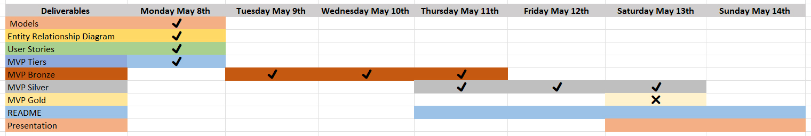
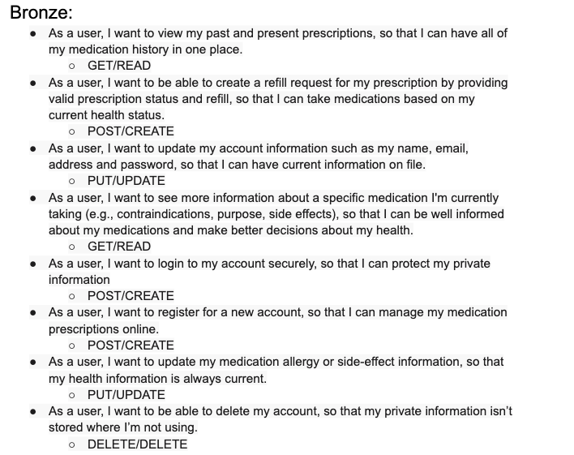
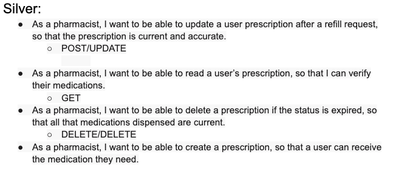
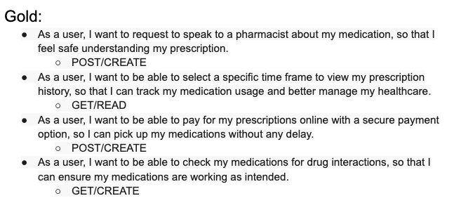
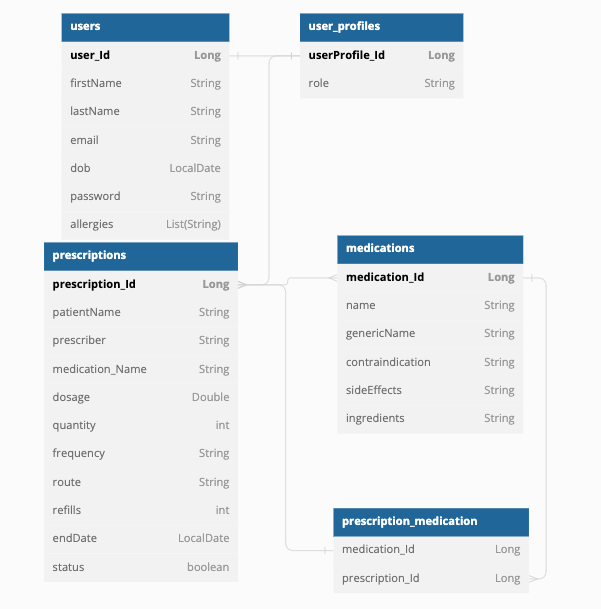
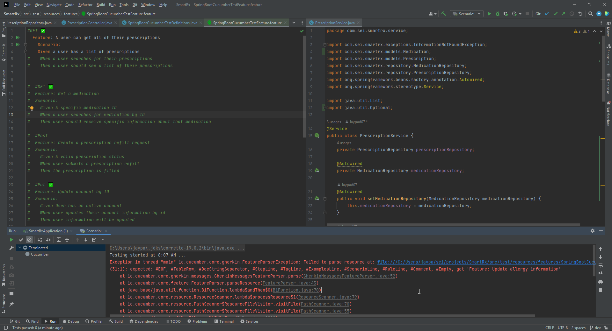
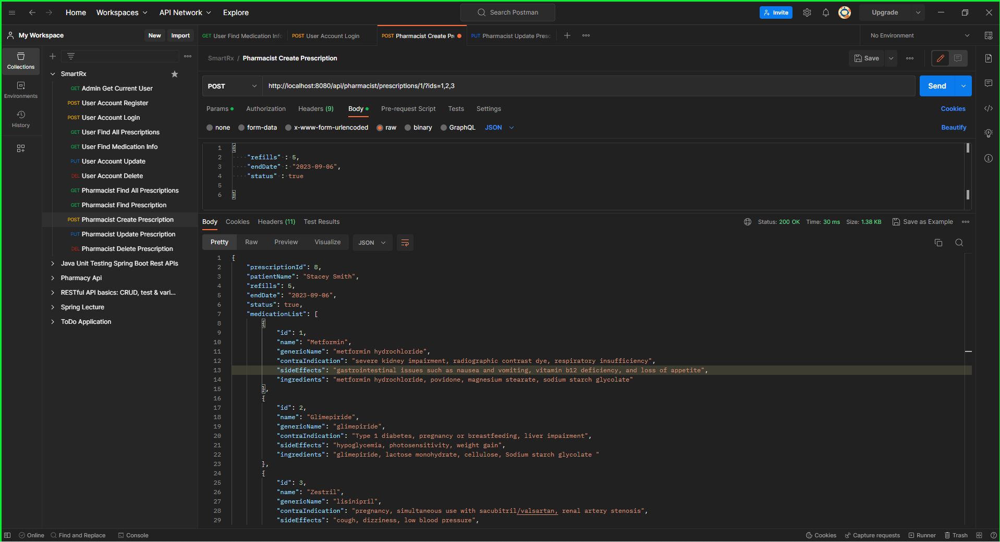
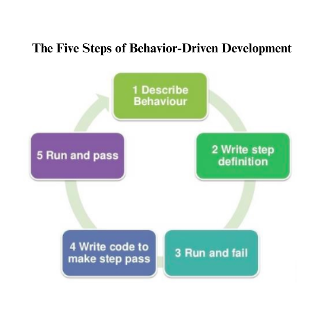
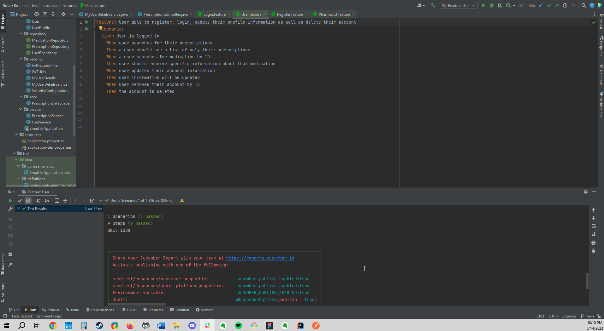

# SmartRx


### Description
SmartRx REST API backend is a Java and Spring Boot application that provides a robust and scalable solution for managing prescription and medication data. It serves as a reliable and efficient backend system to support various client applications such as web, mobile, or desktop applications.


## Table of Contents
- [Product Overview](#product-overview)
- [Key Features](#key-product-features)
- [General Approach](#general-approach)
- [Planning Documentation](#planning-documentation)
- [User Stories](#user-stories)
- [ERD Diagram](#erd-diagram)
- [Unsolved Problems & Hurdles Tackled](#unsolved-problems-and-hurdles-tackled)
- [Testing (TDD Process)](#test-driven-development-tdd)
- [Tools and Technologies](#tools-and-technologies)
- [API Endpoints - User](#api-endpoints---user)
- [API Endpoints - Pharmacist](#api-endpoints---pharmacist)
- [Usage](#usage)
- [Installation Instructions for Dependencies](#installation-instructions-for-dependencies-)
- [How To Install and Run this Application on your own Machine](#how-to-install-and-run-this-application-on-your-own-machine)
- [Contributing](#contributing-)
- [Credits](#credits)
- [References](#references)


## Product Overview

### Planning Documentation
#### Schedule
[](https://github.com/users/Jaypad07/projects/4/views/1?layout=board)

#### User Stories


#### Silver User Stories


#### Gold User Stories


#### ERD Diagram
[](https://dbdiagram.io/d/64595cb6dca9fb07c4b87508)

##### External Links to Planning Documents
- [Link to Planning and Schedule]()
- [Link to ERD DIAGRAM]()
- [Link to User Stories]()

#### Unsolved Problems and Hurdles Tackled

- Merging Branches on Github
- Issues with 'Prescription Data Loader' (seed) file
- Setting up Security Token 
- Functionality Issues with 'createPrescription' Method'
- We Failed Fast!!!

#### Major Wins
- Worked Collaboratively and Creatively
- Reached MVP and Silver Status
- Became Cucumber Champions
- Mastered Many to Many Relationships
- Mastered Many to Many Entity Relationships


[](https://github.com/users/Jaypad07/projects/4/views/1?layout=board)
###### Prescription Feature
One of our major wins was successfully implementing the Prescription feature, which involved incorporating a many-to-many relationship. This achievement allowed us to efficiently manage and track prescriptions, ensuring accuracy and accessibility for both users and healthcare professionals. We are proud of this accomplishment as it significantly enhances the functionality and value of our product.
## Test Driven Development (TDD)

This project follows the Test Driven Development (TDD) approach to ensure the reliability and correctness of the codebase. TDD involves writing tests before implementing the actual code logic.

Here's an overview of the TDD process followed in this project:


1. **Write Tests**: Tests are written in the form of Cucumber feature files using Gherkin syntax. Each feature file describes a specific functionality or scenario to be tested. Test scenarios are written in a user-friendly language that captures the expected behavior of the system.

2. **Run Tests**: The Cucumber tests are executed using the TestRunner and Test Definitions. These files contain the necessary configurations and definitions for running the tests. Tests can be run locally or integrated with a CI/CD system for automated testing on each code commit.

3. **Implement Code**: After writing the tests, the corresponding code implementation is done to make the tests pass. The implementation follows the principles of SOLID design and clean code practices. The tests act as a guide to ensure that the code meets the desired functionality.

4. **Refactor Code**: Once the tests pass, the code is refactored to improve its design, readability, and maintainability. Refactoring involves making changes to the code without altering its behavior. The goal is to enhance the code's structure, eliminate duplication, and improve overall code quality.

5. **Re-run Tests**: After refactoring the code, the tests are re-run to ensure that the changes have not introduced any regressions or unexpected behavior. This step verifies that the code still adheres to the desired functionality defined by the tests.


### Tools and Technologies
- Java
- Spring Boot
- Spring MVC
- Spring Security
- Spring Data JPA
- Hibernate
- Git
- Junit
- Maven
- IntelliJ IDEA


### API Endpoints - User

| Name        | API Endpoint             | HTTP Verb | Purpose                      |
|-------------|--------------------------|-----------|------------------------------|
| Create User | /api/auth/users/register | POST      | Create a new User            |
| Login User  | /api/auth/users/login    | POST      | Logs in a User               | 
| Show User   | /api/users               | GET       | Displays a User              |
| Update User | /api/users               | PUT       | Updates a User               |
| Delete User | /api/users               | DELETE    | Deletes a User from database |


### API Endpoints - Pharmacist

| Name                      | API Endpoint                                             | HTTP Verb | Purpose                               |
|---------------------------|----------------------------------------------------------|-----------|---------------------------------------|
| List User's Prescriptions | /api/prescriptions                                       | GET       | Gets a list of a Users Prescriptions  |
| Get all prescriptions     | /api/pharmacist/prescriptions                            | GET       | Gets all prescriptions                |
| Get one medication        | /api/prescriptions/medications/{medicationId}            | GET       | Gets a specific medication by Id      |
| Get Specific Prescription | /api/pharmacist/prescriptions/{prescriptionId}           | GET       | Gets a Specific Prescription by Id    |
| Create a prescription     | /api/pharmacist/prescriptions/{prescriptionId}/{userId}/ | POST      | Creates a Prescription                |
| Update a prescription     | /api/pharmacist/prescriptions/{prescriptionId}           | PUT       | Updates a Specific Prescription by Id |
| Delete a prescription     | /api/pharmacist/prescriptions/prescription               | DELETE    | Delete a Prescription by Id           |


### Installation Instructions For Dependencies 

1. Open your project in an IDE or navigate to the project directory using the command line.
2. Locate the pom.xml file in the root directory of your project.
3. Open the pom.xml file and locate the <dependencies> section.
4. Copy the dependency block for each dependency mentioned above and paste it inside the <dependencies> section of your pom.xml file.
5. Save the pom.xml file.
6. Build the project to resolve and download the dependencies by running one of the following commands:

- If you are using an IDE like Eclipse or IntelliJ IDEA, you can use the IDE's build or compile command to resolve the dependencies.
- If you are using the command line, navigate to the project directory and run the command mvn clean install. This will trigger the Maven build process and download the dependencies specified in the pom.xml file.
7. Wait for the build process to complete. Maven will download the required dependencies from the Maven Central Repository or other specified repositories.
8. Once the build process is successful, the dependencies should be installed and available for your project to use.

   - Note: If you are using an IDE, it might automatically download the dependencies and update the project configuration. If not, you can manually refresh the project or restart the IDE to ensure that the dependencies are recognized.

### How To Install and Run this Application on your own Machine

To run this application on your local machine, please follow the steps below:

1. Prerequisites

Before proceeding with the installation, ensure that the following prerequisites are met:

- Java Development Kit (JDK) 8 or higher is installed on your machine.
- Apache Maven is installed.
- PostgreSQL database is installed and running.

2. Clone the Repository

Clone the project repository from the GitHub repository using the following command:
```
git clone <repository-url>
```

3. Configure the Database

Open the application.properties file located in the src/main/resources directory. 
Update the database configuration properties according to your PostgreSQL database setup. 
Make sure to provide the correct database URL, username, and password.


4. Build the Application

Navigate to the project's root directory and build the application using Maven. Run the following command:
```
mvn clean install
```

5. Run the Application

After a successful build, run the application using the following command:
```
mvn spring-boot:run
```
The application will start, and you will see the logs indicating the server is up and running.


6. Access the Application

Open your web browser and access the application using the following URL:
```
http://localhost:8080
```
You can now explore and interact with the application.


## Credits

We would like to extend our gratitude to the following individuals for their contributions to this project:

- [Edgar Zambrana](https://github.com/EdgarJoell) - [LinkedIn](https://www.linkedin.com/in/edgar-j-zambrana-0b11a31b2/)
- [Lorena Rojas](https://github.com/lrojas4) 
- [Maksym Zinchenko](https://github.com/maklaut007) 

Our Instructors:
- Leo Rodriguez - [LinkedIn](https://www.linkedin.com/in/leonardo-rodriguez/)
- [Suresh Sigera](https://github.com/sureshmelvinsigera) 
- Dhrubo Chowdhury [LinkedIn](https://www.linkedin.com/in/dhrubo-hasan/)

Their dedication and expertise have greatly contributed to the success of this project. We are grateful for their valuable insights and efforts.


## References
[Security Feature Doc Strings](https://docs.spring.io/spring-security/site/docs/current/api/index.html)

[Add JWT to Header for use with RestTemplate](https://stackoverflow.com/questions/20186497/what-is-the-resttemplate-exchange-method-for...and)

[Git Stashing](https://www.gitkraken.com/learn/git/git-stash#:~:text=Git%20Stash%20List&text=The%20Git%20stash%20list%20command,stash%40%20and%20the%20desired%20index)

[Git Merging - Source: Atlassian](https://www.atlassian.com/git/tutorials/using-branches/git-merge)

[Git Branching - Source: git-scm.com](https://git-scm.com/book/en/v2/Git-Branching-Basic-Branching-and-Merging)

[Rest Assured - Source: github.com](https://github.com/rest-assured/rest-assured/wiki/GettingStarted)

[For ERD  - dbdiagram.com](https://dbdiagram.io/)

[HTTP Status Codes - Source: Mozilla.org](https://developer.mozilla.org/en-US/docs/Web/HTTP/Status)

[Cucumber School - Source: Cucumber.io](https://school.cucumber.io/courses/take/bdd-with-cucumber-java/lessons/9588457-add-a-scenario-wire-it-up)

[Gherkin Syntax - Cucumber.io](https://cucumber.io/docs/gherkin/)

[JSON Jwt Tokens - JWT.io](https://jwt.io)
